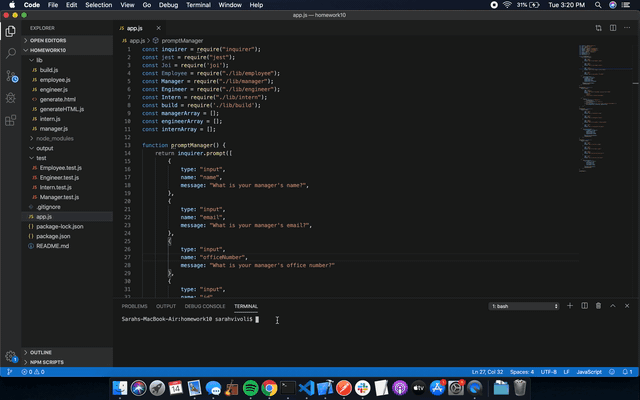

# Employee-Summary

## Links to Project

[Live Link](https://svivoli.github.io/Team-Builder/)  
[Repository](https://github.com/svivoli/Team-Builder)

## Instructions

1. With terminal pointing toward the project's directory, enter the following command:
```sh
node app.js
```
2. Answer the prompts about your manager.
3. Add as many employees as you would like.
4. Once you have added all of your team members, select "I don't want to add more team members." Once this option is selected, your html file, "Team.html", will be created in the output folder .
5. Open the file in your browser.
6. Share and enjoy!
* Running the command a second time will replace the originally created file, so save to a new location or rename before running again.

## Description

A command-line application that takes user inputs to generate an employee summary html file. This is useful for employers as it is a concise summary of their team's information that can be readily accessed or distributed.

### Node Modules

1. Inquirer
2. Jest
3. Fs

### HTML Components

1. Header with title
2. Bootstrap grid
3. Bootstrap cards
- Shadowed
- Card headers
- Card Bodies
- Lists
- Live links
- Borders
4. FontAwesome icons
5. Google Fonts

## User Experience



## Developer Experience

I found this project to be another exciting challenge. Like the GitHub PDF Generator, it had many components to compile and combine. I'm enjoying becoming familiar with node and writing command line applications. Being able to generate files is very useful skill to have in the corporate world and node allows you to do so with code that is generally concise and easy to read.

--Sarah Vivoli

